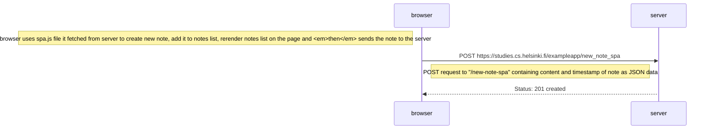

```mermaid
sequenceDiagram
participant browser
participant server
Note left of browser: browser uses spa.js file it fetched from server to create new note, add it to notes list, rerender notes list on the page and <em>then</em> sends the note to the server
browser->>server: POST https://studies.cs.helsinki.fi/exampleapp/new_note_spa
Note right of browser: POST request to "/new-note-spa" containing content and timestamp of note as JSON data
activate server
server-->>browser: Status: 201 created


```
