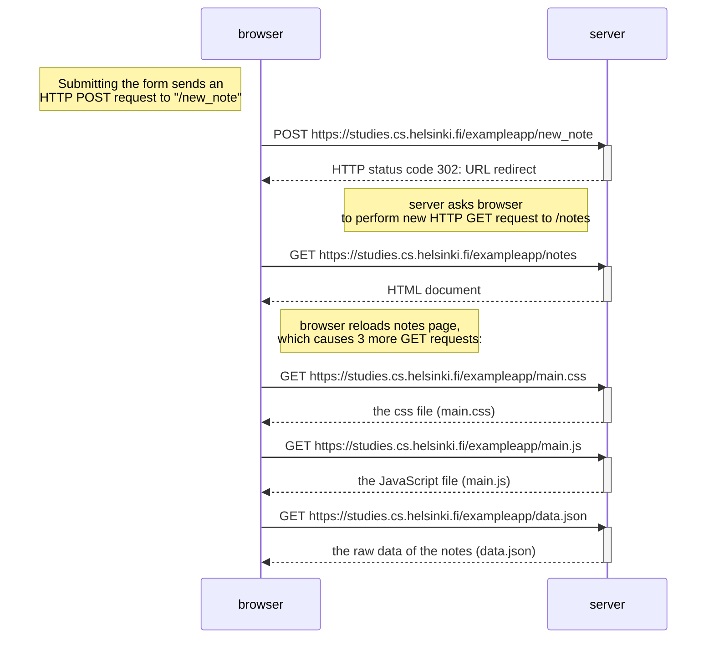

```mermaid
  sequenceDiagram
    participant browser
    participant server
Note left of browser: Submitting the form sends an <br>HTTP POST request to "/new_note"
    browser->>server: POST https://studies.cs.helsinki.fi/exampleapp/new_note
    activate server
    server-->>browser: HTTP status code 302: URL redirect
    deactivate server
    Note left of server: server asks browser <br> to perform new HTTP GET request to /notes


    browser->>server: GET https://studies.cs.helsinki.fi/exampleapp/notes
    activate server
    server-->>browser: HTML document
    deactivate server
Note right of browser: browser reloads notes page,<br> which causes 3 more GET requests:

    browser->>server: GET https://studies.cs.helsinki.fi/exampleapp/main.css
    activate server
    server-->>browser: the css file (main.css)
    deactivate server

    browser->>server: GET https://studies.cs.helsinki.fi/exampleapp/main.js
    activate server
    server-->>browser: the JavaScript file (main.js)
    deactivate server

    browser->>server: GET https://studies.cs.helsinki.fi/exampleapp/data.json
activate server
server-->>browser: the raw data of the notes (data.json)
deactivate server
```
